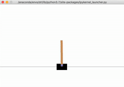
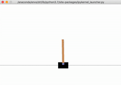
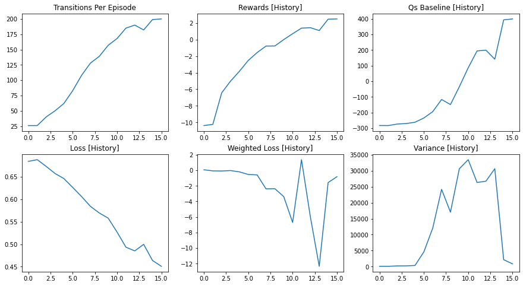

# Deep Reinforcement Learning: Policy Gradient with Monte Carlo and Baseline for Cartpole

The objective of this Python program is to teach the cart to balance the pole upgright, through deep reinforcement learning. The unlearned behavior is shown below (~10 episodes):



<br/>
<br/>

After training and self-learning based on the reward system, and almost 1000 episodes later, the behavior of the cart is transformed into the below (~10 episodes):



The cart learned, through rewards, to balance the pole upgright and reach the end of the episode (200 steps). Below is the full notebook.

<br/>
<br/>


```python
import warnings
warnings.filterwarnings('ignore')


from datetime import datetime
from IPython.display import clear_output
import statistics
import math
import os
import cProfile
import gym
from gym import envs
import numpy as np
# Docs https://www.tensorflow.org/api_docs/python/
import tensorflow as tf
import tensorflow_probability as tfp
from random import random

from pprint import pprint

import matplotlib.pyplot as plt

import numpy as np
import os
import time

os.environ["KERAS_BACKEND"] = "plaidml.keras.backend"

import keras
import keras.applications as kapp
#from keras.datasets import cifar10


def pp(o):
    pprint(vars(o))
    
    
%load_ext tensorboard

print("TensorFlow version: ", tf.__version__)

```

    The tensorboard extension is already loaded. To reload it, use:
      %reload_ext tensorboard
    TensorFlow version:  2.1.0


```python
###### render = True
episodes = 1000


class Buffer(object):
    def __init__(self):

        self.reset_buffer()
        self.max_size = 10000000
    
    
    def reset_buffer(self):
        self.prev_obs = np.array([])
        self.obs = np.array([])
        self.actions = np.array([])
        self.rewards = np.array([])
        self.terminals = np.array([])
        self.q_values = np.array([])
    
    
    def update(self, eps_prev_obs, eps_obs, eps_actions, eps_rewards, eps_terminals, eps_q_values):
        
        self.prev_obs = np.concatenate([self.prev_obs, eps_prev_obs])[-self.max_size:]
        self.obs = np.concatenate([self.obs, eps_obs])[-self.max_size:]
        self.actions = np.concatenate([self.actions, eps_actions])[-self.max_size:]
        self.rewards = np.concatenate([self.rewards, eps_rewards])[-self.max_size:]
        self.terminals = np.concatenate([self.terminals, eps_terminals])[-self.max_size:]
        self.q_values = np.concatenate([self.q_values, eps_q_values])[-self.max_size:]
        
        self.indexes = np.random.permutation(range(len(self.obs)))
    

    
    def get_samples(self, batch, batch_size):
        inds = self.indexes[batch*batch_size:(batch+1)*batch_size]
        
        return  self.prev_obs[inds], self.obs[inds], self.actions[inds],\
                self.rewards[inds], self.terminals[inds], self.q_values[inds]
    
        
        
        
        
class Policy(object):
    def __init__(self, env, nn_dims, learning_rate=0.01):
        self.env = env
        self.action_space = self.env.action_space
        self.observation_space = self.env.observation_space
        
        print('Action Space', self.action_space)
        print('Observation Space', self.observation_space, '\nHigh',
                                   self.observation_space.high, '\nLow', self.observation_space.low,
                                   end='\n\n')
        
        self.epoch = 0
        self.learning_rate = learning_rate
        self.nn_dims = nn_dims
        self.build_nn()
        

        

    def build_nn(self):
        
        self.loss_history = []
        self.weighted_loss_history = []
        self.reward_history = []
        self.baseline_history = []
        self.variance_history = []
        
        layers = [tf.keras.Input(shape=self.observation_space.shape)]
        
        for d in self.nn_dims:
            layers.extend([
                tf.keras.layers.Dense(d, activation='relu', kernel_initializer='glorot_normal'),
                tf.keras.layers.Dropout(0.1),
            ])
            
        layers.append(tf.keras.layers.Dense(self.action_space.n, activation='softmax'))
        
        self.model = tf.keras.models.Sequential(layers) 
        self.optimizer = tf.keras.optimizers.Adam(learning_rate=0.01)
                
            
        
    def get_action(self, ob):
        
        model_output = self.model(tf.Variable([ob]))
        probs = model_output[0].numpy() / sum(model_output[0].numpy())
        action = np.random.choice(np.arange(len(model_output[0])), p=probs)
        return action

        
    
    def train_policy(self, eps_prev_obs, eps_obs, eps_actions, eps_rewards, eps_terminals, eps_q_values):
        print('Total obs', len(eps_prev_obs))
        
        obs = tf.Variable(eps_prev_obs)
        actions = tf.Variable(tf.one_hot(eps_actions, 2))
        
        mean_qs = statistics.mean(eps_q_values)
        qs = tf.Variable(np.array(eps_q_values) - mean_qs, dtype=float)
        
        with tf.GradientTape() as tape:
            logits = self.model(obs, training=True)
            negative_likelihoods = tf.nn.softmax_cross_entropy_with_logits(labels = actions, logits=logits)
            weighted_negative_likelihoods = tf.multiply(negative_likelihoods, qs)
            loss = tf.reduce_mean(weighted_negative_likelihoods)
            
        
        grads = tape.gradient(loss, self.model.trainable_variables) 
        self.optimizer.apply_gradients(zip(grads, self.model.trainable_variables))
        self.loss_history.append(tf.reduce_mean(negative_likelihoods))
        self.weighted_loss_history.append(loss.numpy().mean())
        self.reward_history.append(sum(eps_rewards)/len(eps_rewards))
        self.baseline_history.append(mean_qs)
        self.variance_history.append(tfp.stats.variance(weighted_negative_likelihoods))
            
 
        
class Agent(object):
    
    def __init__(self, env, nn_dims):
        self.env = env
        self.policy = Policy(env, nn_dims)
        self.rewards =  0

    def take_action(self, ob):
        return self.policy.get_action(ob)

    def train(self, eps_prev_obs, eps_obs, eps_actions, eps_rewards, eps_terminals, eps_q_values):
        self.rewards = 0
        ret = self.policy.train_policy(eps_prev_obs, eps_obs, eps_actions, 
                                       eps_rewards, eps_terminals, eps_q_values)
        return ret


class Episode(object):
    def __init__(self, env, agent, render):
        
        self.env = env
        self.agent = agent
        self.render = render
        
        self.prev_obs = []
        self.obs = []
        self.actions = []
        self.rewards = []
        self.terminals = []

        
    def run(self):
        observation = self.env.reset()
        done = False
        t = 0
        while not done:
            if self.render == True: self.env.render()
            action = self.agent.take_action(observation)
            prev_ob = observation
            observation, reward, done, info = self.env.step(action)

            t = t + 1
            
            if done: reward = -300
            if t == self.env.spec.max_episode_steps: reward = 300
            
            self.rewards.append(reward)
            self.prev_obs.append(prev_ob)
            self.obs.append(observation)
            self.actions.append(action)
            self.terminals.append(done)
            
            if done: break
        
        q_values = []       
        gamma = 0.995
        
        for i in range(len(self.rewards)):
            cumul_sum = 0
            for j in range(len(self.rewards[i:])):
                cumul_sum = cumul_sum + self.rewards[i:][j] * math.pow(gamma, j)
            q_values.append(sum(self.rewards[i:]))
                
        return t, self.prev_obs, self.obs, self.actions, self.rewards, self.terminals, q_values


    
def run_episodes(env, agent, min_runs, min_transitions, render=False):
    
    transitions = 0
    runs = 0
    eps_prev_obs = []
    eps_obs = [] 
    eps_actions = [] 
    eps_rewards = [] 
    eps_terminals = []
    eps_q_values = []
    tot_rewards = []
    
    
    while (transitions < min_transitions) or (runs < min_runs):
        ep = Episode(env, agent, render)      
        ep_trans, prev_obs, obs, actions, rewards, terminals, q_values = ep.run()
        
        eps_prev_obs.extend(prev_obs)
        eps_obs.extend(obs) 
        eps_actions.extend(actions)
        eps_rewards.extend(rewards)
        eps_terminals.extend(terminals)
        eps_q_values.extend(q_values)
        tot_rewards.append(sum(rewards))
        
        transitions = transitions + ep_trans
        runs = runs + 1
    
    return runs, transitions, eps_prev_obs, eps_obs, eps_actions,\
           eps_rewards, eps_terminals, eps_q_values, tot_rewards


def run_epochs(env, agent, min_runs, min_transitions, epochs, mult = 4, div = 120, render=False):
    
    strikes = 0
    retries = 0
    max_strikes = 3
    tr_per_run = 9
    tr_per_run_arr = []
    
    buffer = Buffer()
    
    iterating = True
    
    while iterating:
        for i in range(epochs):
            clear_output(wait=True)

            if (i > 500) and tr_per_run == 9: 
                agent.policy.build_nn()
                agent.policy.loss_history = []
                tr_per_run_arr = []
                break

            if tr_per_run < div:
                req_transitions = (min_transitions * (tr_per_run + 1) / (mult*div))
                req_runs = (min_runs * (tr_per_run + 1) / (mult*div))
            else:
                req_transitions = min_transitions
                req_runs = min_runs

            runs, transitions, eps_prev_obs, eps_obs, eps_actions,\
            eps_rewards, eps_terminals, eps_q_values, tot_rewards =\
                                        run_episodes(env, agent, req_runs, req_transitions, render)

            agent.train(eps_prev_obs, eps_obs, eps_actions, eps_rewards, eps_terminals, eps_q_values)

            tr_per_run = int(transitions/runs)
            tr_per_run_arr.append(tr_per_run)

            agent.policy.epoch = i
            
            print("Retries", retries)
            print("Epoch:", i, tr_per_run, req_runs, req_transitions)
            print("Runs:", runs, ', Transitions:', transitions, ',', int(transitions/runs),'transitions per run')
            print("Total Rewards:", statistics.mean(tot_rewards))
            print('Strike', strikes)
            print('\n')

            if tr_per_run > 5:
                fig, axs = plt.subplots(2, 3, figsize=(15, 8))

                axs[0, 0].plot(tr_per_run_arr)
                axs[0, 0].set_title('Transitions Per Episode')

                axs[0, 1].plot(agent.policy.reward_history)
                axs[0, 1].set_title('Rewards [History]')

                axs[0, 2].plot(agent.policy.baseline_history)
                axs[0, 2].set_title('Qs Baseline [History]')

                axs[1, 0].plot(agent.policy.loss_history)
                axs[1, 0].set_title('Loss [History]')

                axs[1, 1].plot(agent.policy.weighted_loss_history)
                axs[1, 1].set_title('Weighted Loss [History]')

                axs[1, 2].plot(agent.policy.variance_history)
                axs[1, 2].set_title('Variance [History]')

                plt.show()


            if int(transitions/runs) >= env.spec.max_episode_steps:
                strikes = strikes + 1

            if transitions >= runs * (env.spec.max_episode_steps): 
                iterating = False
                break
                
            if strikes > max_strikes:
                break
                
        retries = retries + 1
             
            
            
min_transitions = 800
min_runs = 100
epochs = 5000
env = gym.make('CartPole-v0') 
agent = Agent(env, nn_dims = [64, 64, 64])

%time run_epochs(env, agent, min_runs, min_transitions, epochs, mult=2, div = 60, render=False)

env.close()
```

    Total obs 20000
    Retries 0
    Epoch: 15 200 100 800
    Runs: 100 , Transitions: 20000 , 200 transitions per run
    Total Rewards: 499.0
    Strike 0
    
    





    CPU times: user 7min 33s, sys: 2.29 s, total: 7min 35s
    Wall time: 7min 34s


```python
for i in range(100):
    ep = Episode(env, agent, render=True)      
    ep_trans, prev_obs, obs, actions, rewards, terminals, q_values = ep.run()
    print(i, len(q_values), sum(rewards), max(rewards))
    
    
```

    0 13 -288.0 1.0
    1 14 -287.0 1.0
    2 15 -286.0 1.0
    3 24 -277.0 1.0
    4 14 -287.0 1.0
    5 25 -276.0 1.0
    6 12 -289.0 1.0
    7 43 -258.0 1.0
    8 14 -287.0 1.0
    9 45 -256.0 1.0
    10 16 -285.0 1.0
    11 10 -291.0 1.0
    12 12 -289.0 1.0
    13 10 -291.0 1.0
    14 34 -267.0 1.0
    15 27 -274.0 1.0
    16 12 -289.0 1.0
    17 13 -288.0 1.0
    18 21 -280.0 1.0
    19 31 -270.0 1.0
    20 12 -289.0 1.0
    21 40 -261.0 1.0
    22 12 -289.0 1.0
    23 18 -283.0 1.0
    24 20 -281.0 1.0
    25 17 -284.0 1.0
    26 12 -289.0 1.0
    27 20 -281.0 1.0
    28 41 -260.0 1.0
    29 21 -280.0 1.0
    30 19 -282.0 1.0
    31 11 -290.0 1.0
    32 18 -283.0 1.0
    33 26 -275.0 1.0
    34 24 -277.0 1.0
    35 15 -286.0 1.0
    36 11 -290.0 1.0
    37 12 -289.0 1.0
    38 15 -286.0 1.0
    39 11 -290.0 1.0
    40 15 -286.0 1.0
    41 26 -275.0 1.0
    42 14 -287.0 1.0
    43 88 -213.0 1.0
    44 9 -292.0 1.0
    45 13 -288.0 1.0
    46 14 -287.0 1.0
    47 19 -282.0 1.0
    48 21 -280.0 1.0
    49 14 -287.0 1.0
    50 10 -291.0 1.0
    51 29 -272.0 1.0
    52 46 -255.0 1.0
    53 15 -286.0 1.0
    54 17 -284.0 1.0
    55 12 -289.0 1.0
    56 16 -285.0 1.0
    57 21 -280.0 1.0
    58 14 -287.0 1.0
    59 24 -277.0 1.0
    60 22 -279.0 1.0
    61 17 -284.0 1.0
    62 11 -290.0 1.0
    63 31 -270.0 1.0
    64 15 -286.0 1.0
    65 31 -270.0 1.0
    66 45 -256.0 1.0
    67 14 -287.0 1.0
    68 18 -283.0 1.0
    69 21 -280.0 1.0
    70 15 -286.0 1.0
    71 18 -283.0 1.0
    72 17 -284.0 1.0
    73 12 -289.0 1.0
    74 9 -292.0 1.0
    75 12 -289.0 1.0
    76 22 -279.0 1.0
    77 19 -282.0 1.0
    78 12 -289.0 1.0
    79 17 -284.0 1.0
    80 11 -290.0 1.0
    81 9 -292.0 1.0
    82 19 -282.0 1.0
    83 16 -285.0 1.0
    84 16 -285.0 1.0
    85 15 -286.0 1.0
    86 29 -272.0 1.0
    87 17 -284.0 1.0
    88 9 -292.0 1.0
    89 21 -280.0 1.0
    90 16 -285.0 1.0
    91 14 -287.0 1.0
    92 12 -289.0 1.0
    93 20 -281.0 1.0
    94 17 -284.0 1.0
    95 19 -282.0 1.0
    96 44 -257.0 1.0
    97 12 -289.0 1.0
    98 34 -267.0 1.0
    99 31 -270.0 1.0


```python
 agent.policy.model.save_weights('./model-64-64-64-vg')
```


```python
 agent.policy.model.load_weights('./model-64-64-64-vg')
```
